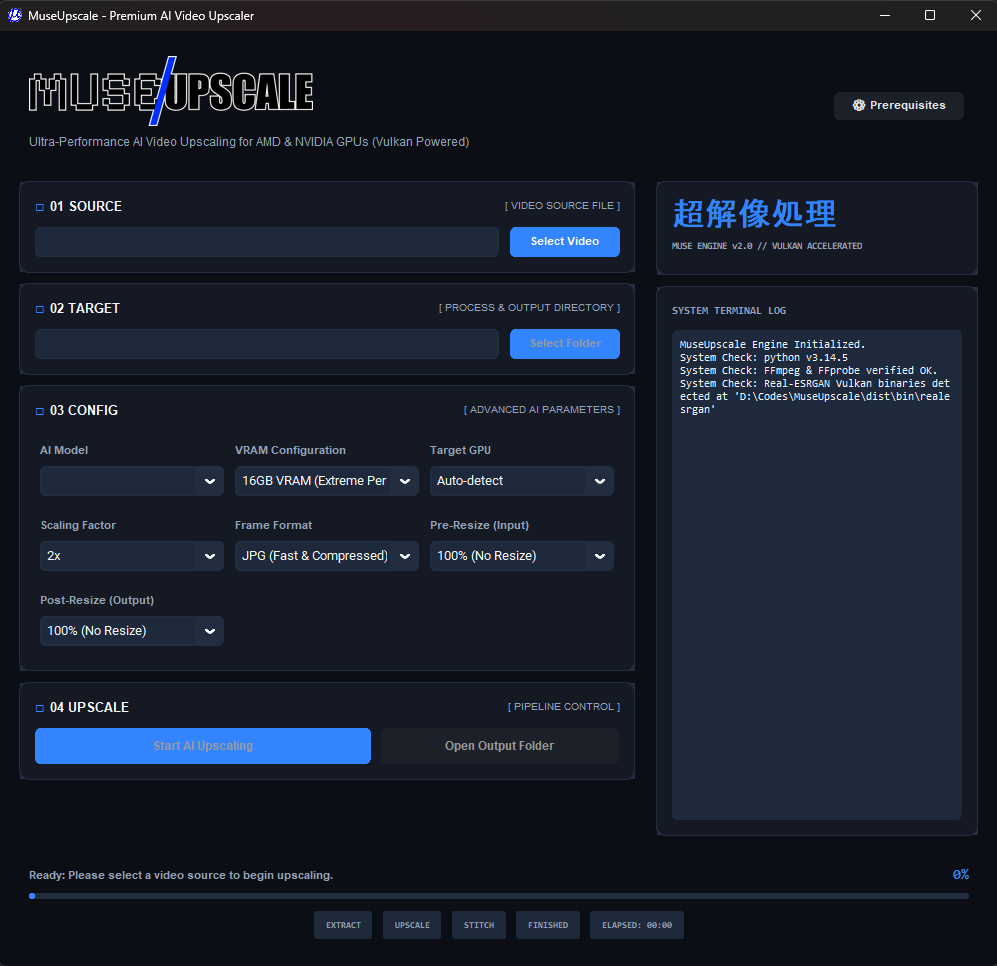
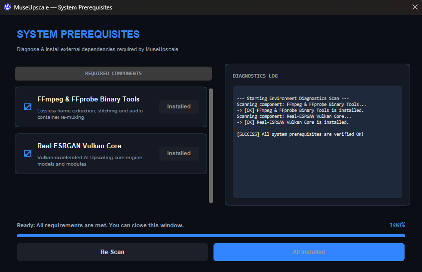

# MuseUpscale

<p align="center">
  
</p>

An ultra-performance, Vulkan-accelerated AI video upscaling desktop application for Windows, optimized for AMD & NVIDIA GPUs.



## Overview

**MuseUpscale** brings high-fidelity AI video enhancement to your desktop with a streamlined, modern Japanese Sci-Fi Minimalism interface. It utilizes the powerful **Real-ESRGAN** engine optimized for Vulkan, making it lightning-fast on modern dedicated GPUs without requiring heavy Python environment installations or command-line scripting.

## Features

- **Integrated Diagnostics & Setup:** Automatically checks and downloads missing components (FFmpeg and Real-ESRGAN Vulkan Core) directly from the application interface.
- **Japanese Sci-Fi Minimalist GUI:** A bespoke Dark Mode interface designed with high-contrast accents and clean typography using CustomTkinter.
- **Advanced Parameter Control:**
  - **AI Model Selection:** Choose between `realesr-animevideov3` (speed-optimized for anime), `realesrgan-x4plus-anime` (quality-optimized for anime), and `realesrgan-x4plus` (general/realistic video model).
  - **Scaling & Resolution Controls:** Choose scaling factors (2x, 3x, 4x) and configure pre-scaling (input resize) or post-scaling (output resize) to match your GPU's capabilities.
  - **VRAM Configurations:** Presets range from low VRAM devices to extreme performance (16GB+ VRAM) configurations.
  - **Multi-Format Output:** Supports saving frames as fast/compressed JPG, balanced WebP, or lossless PNG before stitching.
- **Live Terminal Logging:** Monitor extraction, upscaling progress, and stitching sequences in real-time.

---

## Getting Started

### Prerequisites

MuseUpscale requires standard GPU drivers with Vulkan support (included automatically in modern NVIDIA and AMD driver packages). External tools such as **FFmpeg** and **Real-ESRGAN** are checked on launch and can be automatically set up using the built-in prerequisite checker.



### Installation

1. Download the latest `MuseUpscale.exe` standalone executable from the Releases section.
2. Run `MuseUpscale.exe`.
3. If prompted, click **Download & Install AI Engine** or open the **⚙ Prerequisites** window to scan and download the required binaries automatically.

### Running from Source

If you prefer to run from source, ensure you have Python 3.10+ installed:

```bash
# Clone the repository
git clone https://github.com/roybookmaker/MuseUpscale.git
cd MuseUpscale

# Install requirements
pip install -r requirements.txt

# Launch the app
python run.py
```

---

## How it Works

1. **Extraction:** The video is demuxed, and individual frames are extracted losslessly using **FFmpeg** into a temporary workspace.
2. **AI Upscaling:** The **Real-ESRGAN Vulkan Core** processes the frames using GPU-accelerated neural networks.
3. **Stitching:** The enhanced frames are combined back with the original audio stream into a final upscaled MP4 video.
